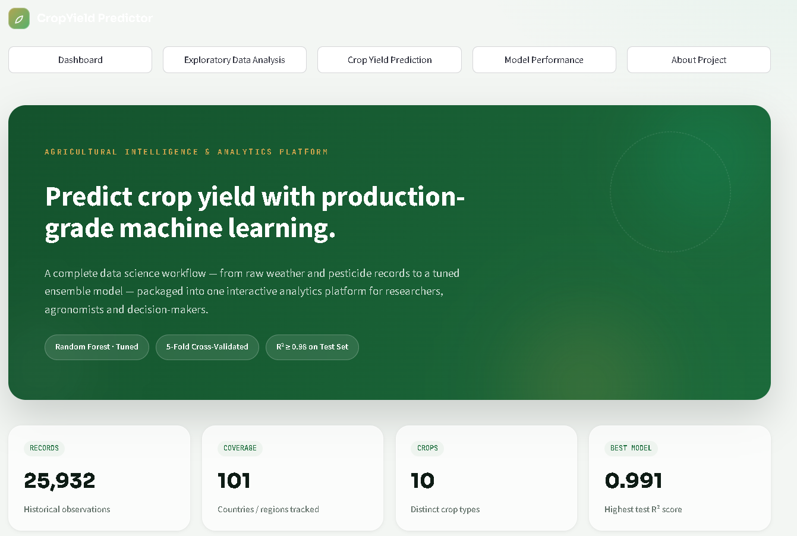

# 🌾 Crop Yield Predictor - Agricultural Intelligence


An end-to-end Machine Learning project that predicts agricultural crop yield using historical weather, rainfall, pesticide usage, and temperature data. The project follows a complete Data Science workflow from data preprocessing and exploratory data analysis to model deployment through an interactive Streamlit dashboard.

---

## Live Demo

**Streamlit App**

https://cropyield-predictor-agricultural-intelligence.streamlit.app/

## Dashboard Preview



**GitHub Repository**

https://github.com/nidhi-yadav20799/CropYield-Predictor-Agricultural-Intelligence

---

## Project Overview

Crop Yield Predictor estimates agricultural crop yield using historical agricultural and climatic data. The project demonstrates an industry-style Machine Learning workflow including:

- Data Validation
- Data Cleaning
- Exploratory Data Analysis
- Feature Engineering
- Machine Learning Pipeline
- Model Comparison
- Hyperparameter Tuning
- Model Deployment
- Interactive Streamlit Dashboard

---

## Objectives

- Predict agricultural crop yield accurately
- Perform comprehensive Exploratory Data Analysis (EDA)
- Engineer meaningful agricultural features
- Compare multiple regression algorithms
- Build a reproducible Scikit-Learn Pipeline
- Deploy an interactive Streamlit application

---

## Tech Stack

| Category | Technology |
|----------|------------|
| Programming Language | Python |
| Data Analysis | Pandas, NumPy |
| Visualization | Matplotlib, Seaborn, Plotly |
| Machine Learning | Scikit-Learn, XGBoost |
| Model Tuning | RandomizedSearchCV |
| Model Serialization | Joblib |
| Dashboard | Streamlit |

---

## Dataset

**Source:** Kaggle Crop Yield Prediction Dataset

### Target Variable

- hg/ha_yield

### Input Features

- Area
- Item (Crop)
- Year
- Average Rainfall (mm/year)
- Pesticides (tonnes)
- Average Temperature

---

## Project Structure

```text
CropYield-Predictor/
│
├── dashboard/
│   └── app.py
│
├── data/
│   ├── raw/
│   └── processed/
│
├── images/
├── models/
├── notebooks/
├── reports/
├── src/
│
├── requirements.txt
├── runtime.txt
├── README.md
└── .gitignore
```

---

## Workflow

### Data Preparation

- Dataset loading
- Data validation
- Missing value analysis
- Data dictionary generation

### Data Cleaning

- Duplicate removal
- Data type validation
- Outlier detection using IQR
- Clean dataset generation

### Exploratory Data Analysis

The project includes professional visualizations including:

- Histograms
- KDE Plots
- Boxplots
- Correlation Heatmap
- Feature Correlation Analysis
- Pair Plot
- Crop Yield by Region
- Rainfall vs Yield
- Temperature vs Yield
- Feature Importance
- Residual Distribution
- Model Comparison

---

## Feature Engineering

Custom engineered agricultural features include:

- Rainfall Category
- Temperature Category
- Pesticide Category
- Growing Degree Days (GDD)
- Rainfall–Temperature Ratio
- Yield per Unit of Pesticide

---

## Machine Learning Models

Implemented using Scikit-Learn Pipeline and ColumnTransformer.

Models evaluated:

- Linear Regression
- Ridge Regression
- Random Forest Regressor
- Gradient Boosting Regressor
- XGBoost Regressor

The deployed application uses the tuned **Random Forest Pipeline** for prediction.

---

## Model Performance

| Model | MAE | RMSE | R² Score |
|------|------:|------:|------:|
| XGBoost | 4222.77 | 8054.37 | 0.9910 |
| Random Forest | 3179.96 | 8075.55 | 0.9910 |
| Gradient Boosting | 15668.08 | 25789.02 | 0.9082 |
| Linear Regression | 29923.86 | 42703.46 | 0.7484 |
| Ridge Regression | 29885.65 | 42717.57 | 0.7482 |

---

## Streamlit Dashboard

The deployed dashboard includes:

### Dashboard

- Project overview
- Dataset summary
- Key insights

### Exploratory Data Analysis

- Interactive visualizations
- Correlation analysis
- Distribution analysis

### Crop Yield Prediction

- Region selection
- Crop selection
- Climate input controls
- Live crop yield prediction
- Prediction summary

### Model Performance

- Model comparison
- Residual analysis
- Feature importance
- Evaluation metrics

### About Project

- Workflow
- Technologies
- Project summary

---

## Key Features

- End-to-End Machine Learning Workflow
- Professional Data Cleaning Pipeline
- Feature Engineering
- Multiple Model Comparison
- Hyperparameter Optimization
- Reproducible ML Pipeline
- Interactive Streamlit Dashboard
- Live Crop Yield Prediction
- Production-Ready Deployment

---

## Installation

```bash
git clone https://github.com/nidhi-yadav20799/CropYield-Predictor-Agricultural-Intelligence.git

cd CropYield-Predictor-Agricultural-Intelligence

pip install -r requirements.txt

streamlit run dashboard/app.py
```

---

## Future Improvements

- Weather API Integration
- Satellite Data Integration
- Deep Learning Models
- Crop Recommendation System
- Farmer Decision Support System

---

## Author

**Nidhi Yadav**

B.Sc. Data Science Graduate

GitHub:
https://github.com/nidhi-yadav20799


---

If you found this project useful, consider giving it a ⭐ on GitHub.